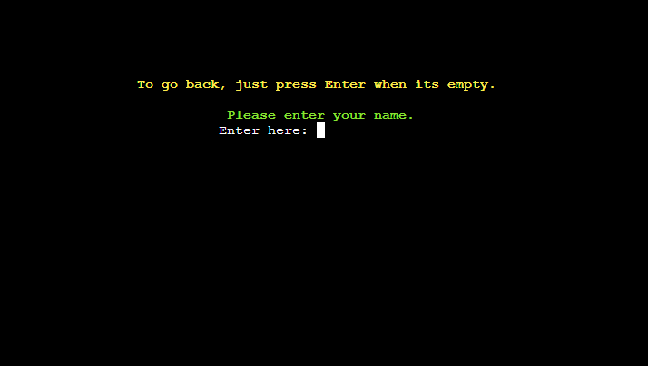
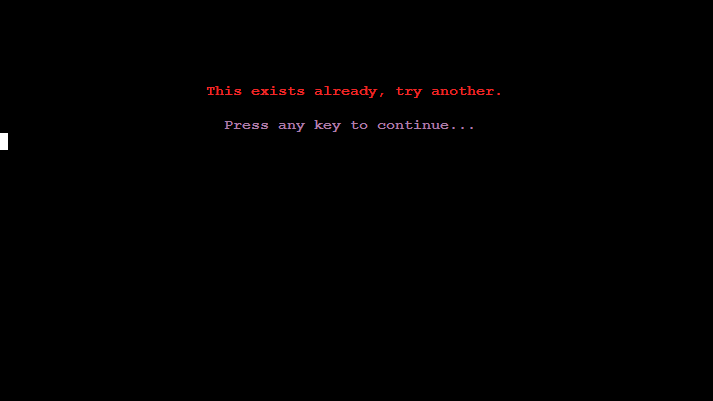

# Daily Math

Daily Math is a Python terminal game which runs on a mock terminal.

The goal is to challange you to complete 5 math questions per day, either go the easy route or the hard one. You will earn treats either way, but at what cost...

Live app: https://daily-math.herokuapp.com/

# User Experiance (UX)
## User Stories
- The game should be easy to navigate
- Should encurage me to complete the daily tasks
- If the question in hand is to hard, give me the solution.

## User feedback
- The game keeps asking if Im sure to procceed, cause I go for the lower age group. I like it easy.. okey.
    - Keeping that feature because it should be a remainder that you need to progress even further and move up to the more challenging questions.

# Design
I used <a href="https://lucid.app/">Lucid flowcharts</a> to help me with the flow of the project.

## Login


## Menu


## Difficulty


# Development
To Develop this app, the developer had to think how the app would progress throughout it steps which required a bit of thinking and learning how the code flowed. The logic behind all the functions is quite easy if you break them down to smaller chunks, but a bit of thinking is required to make it functional.

# Strategy
The logic behind each function is simple but requires a bit of practice and failure to reach the final product. As mentioned before by breaking down the code into smaller chunks and each function to its core, it is quite easy to code this. But to make it work the developer needs to read documents and tutorials to grasp the concept and the fundamentals.

## Feature / Testing
- Welcomes the player to the game and prompts you to answer the question if your a new or old player.


- Here we took the route (Y) for yes we are a new user. And here we are prompted to enter our name. Which accepts alphabetic and numeric characters.



- Tried to enter (!) which is not alphabetic or numeric character, to return we simply press any key. Which sends us back to the previous page.


- Back at when we were prompted to enter our name I entered more then 15 characters, which is the limit. And again it gives us the path back to previous page.


- Now I tried to enter my name "Jörgen" which I already created beforehand, to get this error. Again, we get the path back to previous page.



- Now I entered "Brattäng" instead, and that went through. So now I'm prompt to enter a pin code.


- I tested to write just "1" and you get an error, this will happen until you enter a 4 digit pin code. No matter what you enter, so it only checks for example: 1234 which I entered.


- Here we get prompt to enter our year of birth, and it will give out the same error as before. But with a difference.


- And as you might have guess, this is the key difference "year of birth". I have chosen not to display that you need to enter a specific year, cause this app will live on forever and I don't want to destroy it for future users.


- I now entered "1991" which is when I was born, which led us to this page. That tells us the account is setup and ready to start using. And prompts us back to enter name, but with a difference. Now we have entered if we went the route of (N), so we are now a user that already got an account.


- Lets see what happens if we write "random". We get told that the account don't exist and get promted to try again. Lets press (N)


- We get sent back to the start page. And to get back were we where we just press (N) for new user. And this gives the same errors as before if you enter not alphabetic or numeric, likewise with to many characters. Lets enter "Brattäng" now.


- Now we are back to enter our pin code, and the same errors before if you try something else that isn't ours. But a key difference.


- I entered not "1234" but "5648" instead and get this, and this will continue until you get it right or fail three times. Lets see what happens after three times.


- Second try


- Now we get that we tried 3 times, and get asked if we are "Brattäng" which we entered. And to try again, we will say (Y) to continue, otherwise we will just go back to start screen.


- Now we are finaly logged in, and gets greeted with our name and gets the current date. And to continue on our adventure.


- And we get an inspiring quote that is motivational. This is random, so it's different each time. And again press to continue.


- And now we get our goal of our adventure, to gain 5 treats each day. And it tells us our total amount that we accumulate over time. For now these are empty.


- Now we are finally at the menu, where we get choices to make. Lets press (5) to start!


- As suspected we made the wrong choice and gets greeted by an error, lets press any key to continue. And press (1) instead.


- Now we have a though choice, as we entered year of birth 1991 our age is now "31" at the time of writing this. But first lets check if you press (5) or any other then 1 - 4.


# Testing
To see the testing part, please follow this link: Testing.md

## Unsolved bugs
- Could not disable the keyboard while the sleep() was working it's magic. Tried different approaces but none that I could implement.

# Technologies used
## Language
- Python

## Frameworks libraries and programs Used
- <a href="https://gitpod.io/" title="Link to gitpod" rel="nofollow">GitPod</a>
    - GitPod was used for writing code, committing, and then pushing to GitHub.
- <a href="https://github.com/" title="Link to github" rel="nofollow">Github</a>
    - GitHub was used to store the project after pushing

```python
from random import randint # For random numbers

from datetime import date # To get the date

from time import sleep # To sleep in between, for UX

import os # To clear the screen in between text

from readchar import readkey, key # To get read keyboard presses, instead of using input
```

# Credit

## Deployment description
Huge thank you to <a href="https://github.com/Delboy/Fruit-Hunter">Delboy</a> with the excellent description on how the deployment went. 

## Quotes of the day:
https://www.brainyquote.com/topics/motivational-quotes

```
"Ever tried. Ever failed. No matter. Try Again. Fail again. Fail better." 
- Samuel Beckett
```

## Math questions

- https://www.kidzone.ws/math/wordproblems.htm
    - Example:
```
Ben has 4 peaches. Sarah has 3 peaches. How many peaches do they have in all?
```

- https://www.cuemath.com/learn/fun-maths-questions/#30%20Fun%20Maths%20Questions%20with%20answers
    - Example:
```
What is the number of the missing sequence: 16 09 68 88 ?? 98
```

# Credited Code

- https://teamtreehouse.com/community/using-a-clearscreen-in-pycharm
```python
def clear_screen():
    os.system('cls' if os.name == 'nt' else 'clear')
```

- https://www.youtube.com/watch?v=SuEk_TBkReQ&t=2s
```python
def create_chunk_list(my_list, chunk_size):
        """ Creates smaller chunks of list """
        for i in range(0, len(my_list), chunk_size):
            yield my_list[i:i + chunk_size]
```

- https://littlelearningcorner.com/2021/11/fun-math-questions-for-kids-k-2.html

## Great Tutorials

- Register Keypresses
https://pypi.org/project/readchar/

# Deployment
To make this project I used the Code Institute's mock terminal for Heroku and their way of linking to Google Sheet API.

## Create Repository
For this I used Github.
1. Go to your profile, and press on "Repositories".
2. Press "New" (Big green button).
3. There I chose to use a template from Code Institute to have everything I needed for this project.
4. Named my project "daily-math".
5. Then clicked on "Create repository".
6. Onces created, I opened the repository and clicked on "Gitpod" to create a new workplace.

## Github Pages
1. Went to my repository "daily-math".
2. Settings tab.
3. Pages.
4. Chose my branch to be main.
5. Hit save and a couple of minutes later it was deployed.

## Forking
1. Login to Github and go to my <a href="https://github.com/JorgenBrattang/daily-math">repository</a>
2. Find the Fork button o the top right corner.
3. Press it.
4. The fork is now in your own repository.

## Clone
- Credit to <a href="https://github.com/Delboy/Fruit-Hunter">Delboy</a> for the magnificent description!

1. Login to Github and go to my <a href="https://github.com/JorgenBrattang/daily-math">repository</a>
2. Above the list of files click the green ‘code’ button.
3. This will bring up a few options as to how you would like to clone. You can 4. select HTTPS, SSH or Github CLI, then click the clipboard icon to copy the URL.
4. Open git bash
5. Type ‘git clone’ and then paste the URL you copied. Press Enter.

## Setting up google sheets API
- Credit to <a href="https://github.com/Delboy/Fruit-Hunter">Delboy</a> for the excellent description!

To set up google sheets API you must;

1. Head to https://console.cloud.google.com/ and sign in or create a free google account.
2. From the google cloud platform dashboard click 'Select a new project'. Then select 'New project'.
3. Create a name for your project under 'Project name' then click 'Create'.
4. This should bring up a box with your project in. Underneath click 'SELECT PROJECT'.
5. From the sidebar navigate to 'APIs and services', 'Library'.
6. In the search bar search for google drive.
7. Select 'Google drive API' and click 'ENABLE'.
8. Click the 'CREATE CREDENTIALS' button located to the top right of the page.
9. From the dropdown menu under 'Which API are you using?' select 'Google drive API'.
10. Under 'What data will you be accessing' choose 'Application data'.
11. Under 'Are you planning to use this API with Compute Engine, Kubernetes Engine, App Engine or Cloud Functions?' select 'No, i'm not using them' and click 'NEXT'.
12. Enter a Service Account Name. You can name it whatever you like. I would suggest naming it the same as what you named your project. Then click 'CREATE AND CONTINUE'.
13. In the 'Role' dropdown menu select 'Basic', 'Editor', then click 'Continue'.
14. The next page can be left blank so just click 'DONE'.
15. Under 'Service Accounts' find the account you just created and click it.
16. Navigate to the 'KEYS' tab and click 'ADD KEY', 'Create new key'. Select 'JSON' and click 'CREATE'.
17. This will download a json file to your machine. This normally downloads into your 'downloads' folder but if you're unsure you can right click the file once it's downloaded and click 'show in folder' to locate it.
18. Next we will have to link the Google Sheets API. To do this navigate back to the library by clicking on the burger icon in the top left hand corner and selecting 'APIs and services', 'Library' from the dropdown menu.
19. In the search bar search for 'Google Sheets' and select 'Google Sheets API' and click 'ENABLE'.
20. Now, using a programme like Gitpod open or create a repository.
21. Drag and drop the json file that you downloaded earlier into your workspace. Rename this file to 'creds.json'.
22. Open the file and copy the email address under 'client_email' without the quotation marks.
23. Open up the google sheet you want to use and click the 'Share' button.
24. Paste in the client email. Make sure 'Editor' is selected, untick 'Notify people' and then click 'Share'.
25. To protect sensitive information be sure to add your creds.json file to your .gitignore file inside your editor.
26. In order to use our google sheets API you need to install two additional dependencies into your project. To do this, inside your python workspace on the first line input 'import gspread' and on the line beneath input 'from google.oauth2.service_account import Credentials'.

27. Underneath the two imports copy and paste this code, inserting the name of your google spreadsheet where it says 'google_sheet_name_here'.

```
SCOPE = [ "https://www.googleapis.com/auth/spreadsheets", "https://www.googleapis.com/auth/drive.file", "https://www.googleapis.com/auth/drive" ]

CREDS = Credentials.from_service_account_file('creds.json') SCOPED_CREDS = CREDS.with_scopes(SCOPE) GSPREAD_CLIENT = gspread.authorize(SCOPED_CREDS) SHEET = GSPREAD_CLIENT.open('google_sheet_name_here')
```

28. Your APIs will now be linked to your project.

## Setting up heroku
- Credit to <a href="https://github.com/Delboy/Fruit-Hunter">Delboy</a> for the beautiful description!

To set up heroku you must;

1. If your requirements.txt file has not changed you can skip this step. Otherwise, in your terminal type 'pip3 freeze > requirements.txt' then save and push the changes.
2. Go to Heroku.com and sign in or create a free account.
3. From the heroku dashboard click the 'Create new app' button.
4. Name the app something unique and choose what region you are in then click 'Create app'.
5. Go to the settings tab and find the Config Vars section. Click 'Reveal Config Vars'.
6. If your project does not use a creds.json file then skip this step. Otherwise, in the field for KEY enter the value CREDS in all capitals. In the field for VALUE copy and paste the entire contents of your creds.json file from your project. Then click 'Add'.
7. In the field for KEY enter PORT in all capitals, then in the field for VALUE enter 8000. Then click 'Add'.
8. Scroll down to the Buildpacks section and click 'Add buildpack'.
9. Click Python then save changes.
10. Add another buildpack by clicking 'Add buildpack' and this time click Nodejs then save changes.
11. Make sure that Python appears above Nodejs in the buildpack section. If it does not you can click and drag them to change the order.
12. Then head over to the deploy section by clicking deploy from the nav bar at the top of the page.
13. From the 'Deployment method' section select GitHub and click 'Connect to GitHub'.
14. Enter the repository name as it is in GitHub and click 'search'.
15. Click the 'connect' button next to the repository to link it to heroku.
16. To deploy, scroll down and click the 'Deploy Branch' button.
17. Heroku will notify you that the app was successfully deployed with a button to view the app.
18. If you want to rebuild your app automatically you can also select the 'Enable Automatic Deploys' button which will then rebuild the app every time you push any changes.

# Developer's part

## What I learned
The developer learn basic Python coding and how to implement libarys to make life a little easier, and not invent the wheel again.

## Continued development
To further develop this game, it would be to add even more questions and improve the solution to make a step by step guide to show the user how it was solved.

## Acknowledgements
I would like to acknowledge my mentor <a href="https://github.com/seunkoko" title="Link to GitHub profile" rel="nofollow">Oluwaseun Owonikoko</a> which guided me to make the app more interesting and threw me idea's that I did not think about.

 My family for helping me progress and support me, and not to forget the tutors and community of slack that helped me alot to understand the concepts of programming and hardship of debugging.

 And can't thank <a href="https://github.com/Delboy/Fruit-Hunter">Delboy</a> enough for the time saver with the informative description for deployment, saved me hours of writing and I'm so thankfull!