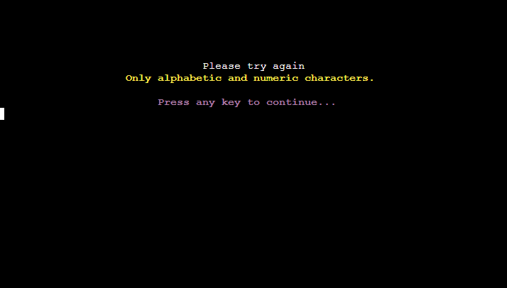
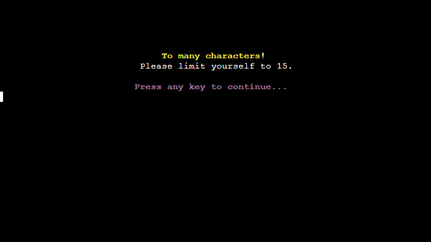
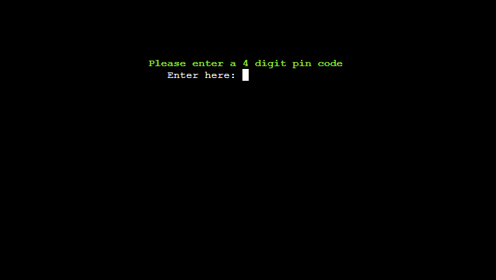
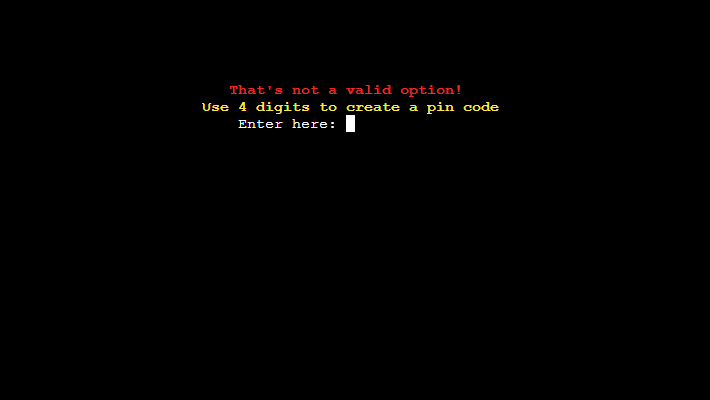
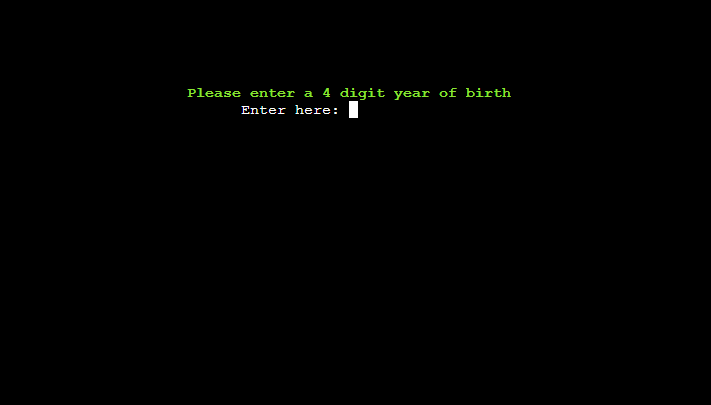
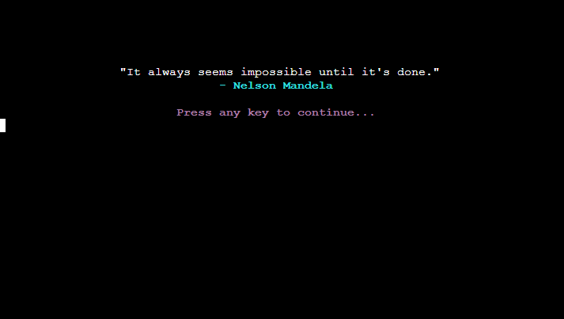
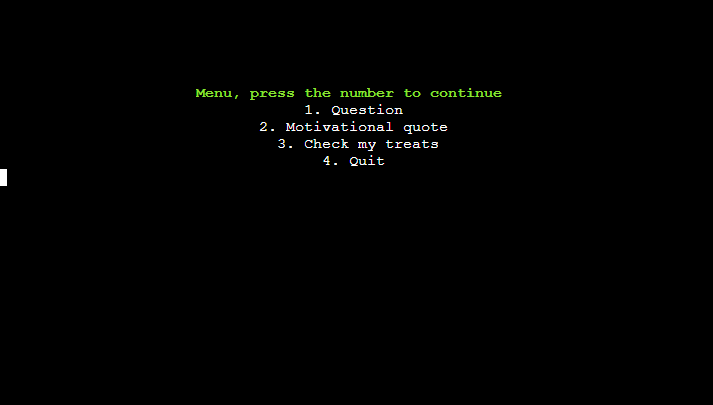
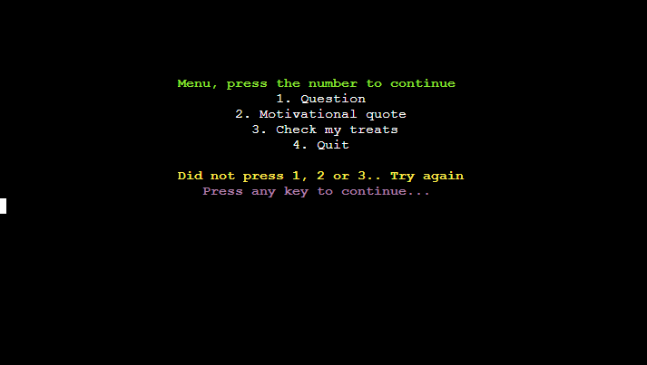
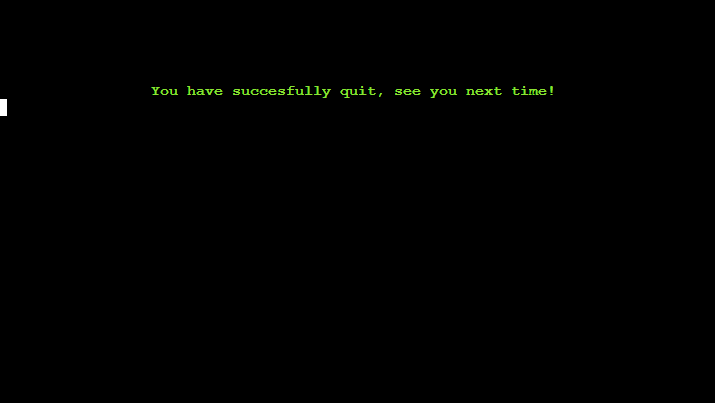

- Welcomes the player to the game and prompts you to answer the question if your a new or old player.

- Here we took the route (Y) for yes we are a new user. And here we are prompted to enter our name. Which accepts alphabetic and numeric characters.

- Tried to enter (!) which is not alphabetic or numeric character, to return we simply press any key. Which sends us back to the previous page.

- Back at when we were prompted to enter our name I entered more then 15 characters, which is the limit. And again it gives us the path back to previous page.

- Now I tried to enter my name "Jörgen" which I already created beforehand, to get this error. Again, we get the path back to previous page.

- Now I entered "Brattäng" instead, and that went through. So now I'm prompt to enter a pin code.

- I tested to write just "1" and you get an error, this will happen until you enter a 4 digit pin code. No matter what you enter, so it only checks for example: 1234 which I entered.

- Here we get prompt to enter our year of birth, and it will give out the same error as before. But with a difference.

- And as you might have guess, this is the key difference "year of birth". I have chosen not to display that you need to enter a specific year, cause this app will live on forever and I don't want to destroy it for future users.

- I now entered "1991" which is when I was born, which led us to this page. That tells us the account is setup and ready to start using. And prompts us back to enter name, but with a difference. Now we have entered if we went the route of (N), so we are now a user that already got an account.

- Lets see what happens if we write "random". We get told that the account don't exist and get promted to try again. Lets press (N)

- We get sent back to the start page. And to get back were we where we just press (N) for new user. And this gives the same errors as before if you enter not alphabetic or numeric, likewise with to many characters. Lets enter "Brattäng" now.

- Now we are back to enter our pin code, and the same errors before if you try something else that isn't ours. But a key difference.

- I entered not "1234" but "5648" instead and get this, and this will continue until you get it right or fail three times. Lets see what happens after three times.

- Second try

- Now we get that we tried 3 times, and get asked if we are "Brattäng" which we entered. And to try again, we will say (Y) to continue, otherwise we will just go back to start screen.

- Now we are finaly logged in, and gets greeted with our name and gets the current date. And to continue on our adventure.

- And we get an inspiring quote that is motivational. This is random, so it's different each time. And again press to continue.

- And now we get our goal of our adventure, to gain 5 treats each day. And it tells us our total amount that we accumulate over time. For now these are empty.

- Now we are finally at the menu, where we get choices to make. Lets press (5) to start!

- As suspected we made the wrong choice and gets greeted by an error, lets press any key to continue. And press (1) instead.

- Now we have a though choice, as we entered year of birth 1991 our age is now "31" at the time of writing this. But first lets check if you press (5) or any other then 1 - 4.

- As suspected we get an error message, that we didn't enter the right number. Lets try again with age 3-5 to see what happens.

- Because of my age "31" I get asked if I want to continue on this difficulty cause it was for age 3-5, and same goes for age 6-12 (no difference). So if we press (N) we get thrown back to the difficulty menu. So lets press (Y).

- First we get asked if we want to go back, and to do that just leave the input field empty and press "Enter". Lets try to answer wrong first.

- We are now told that we got the wrong answer, and got three tries and a choice to be made after that. Lets continue.

- We get thrown back to the question, but without the return. Cause we already know that. Lets continue to answer wrong.

- As suspected 2 out of 3. Lets do that again.

- Now we get our choice that was promised. And lets try to press wrong again.

- We get an error, and to continue to try.

- If we press (2), we get thrown back to the same question as befor but with three new tries. If we press (3), we go back to the main menu. So lets press (1).

- As you can tell I got another question here, due to the fact when I'm doing this I have redo my steps sometimes and since it's random it gave me another question. But the principle is the same, the question is told again and you are given the answer. If we answer (N) we will go back to main menu. So lets press (K) or any other button then (Y) to test it.

- Now we get a suspected error, lets continue.

- Lets press (Y) on this to try again.

- Now we are back at another random question. Lets answer right, which is (10).

- First we get greeted that we are correct, and gets a treat for our accomplishment. And displays our todays effort and total. And as you can see that is 3 out of 5 now, and I played two times before this to show one other then 1 out of 5. Lets make it so we get 5 out of 5 to see what happens.

- We get a great job, and we are free to continue. That 5 out of 5 counter will continue to count. So 6 out of 5... and so on. Now we get promted to press (Y) or (N) again. And if we press other that that the previous error we had when we tested solutions error, this will give the same so no need to show that. So lets press (Y) so I can show you another error message which is for the more advance questions, but still avaliable in the lower ages.

- You answer includes a dot, use commas. This is done so no commas is entered when answering the harder questions on the higher age groups. I have chosen not to fix from dot to commas cause most calculations is done using commas. After that we get the 1 out of 3 error message.

- So lets head back to the main menu.

- So lets head back to the main menu. And press (2).

- And espected a nice motivational quote. Lets continue. And press (3) in the main menu to check my treats.

- Here we get show that we are complete with our tasks, and as you can see I cheated a little bit, now it shows 8 out of 5 and total earned 14. Just to show you that it will change over time. The total will never get reset, but the 5 out of 5 will get reset when the date is not the same as before. Now all its left to press is 4. Quit.

- And we get prompt to anser yes or no.

- If we missclick this happens. So if we press (N) we simply go back to main menu. Lets press (Y).

- And you successfully quit the app.

